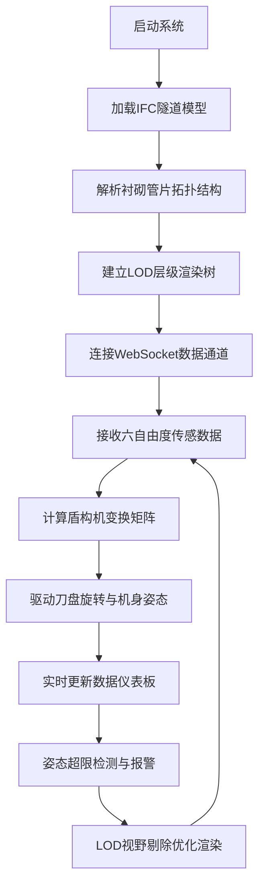

## 1. 产品概述

盾构机姿态监控三维大屏系统是面向大型地下土木工程的专业级实时监控平台，通过三维可视化技术实现盾构机掘进全过程的数字化孪生监控。

- 主要用途：为隧道施工现场提供高精度、低延迟的盾构机姿态实时监控，辅助工程师进行掘进决策
- 解决问题：传统二维监控无法直观展示复杂空间姿态关系、隧道衬砌管片拓扑可视化缺失、长距离隧道渲染性能瓶颈
- 目标用户：隧道工程师、施工现场管理人员、盾构机操作手

---

## 2. 核心功能

### 2.1 用户角色

| 角色 | 登录方式 | 核心权限 |
|------|----------|----------|
| 系统管理员 | 账号密码登录 | 全功能访问、系统配置、用户管理 |
| 现场工程师 | 账号密码登录 | 实时监控、数据导出、历史回放 |
| 盾构机操作手 | 账号密码登录 | 实时姿态监控、报警确认 |

### 2.2 功能模块

1. **三维监控主页面**：IFC隧道模型加载、盾构机实时姿态展示、掘进动画驱动
2. **数据仪表板**：六自由度参数实时显示、姿态偏差预警、历史数据曲线
3. **模型管理模块**：IFC文件上传解析、衬砌管片拓扑可视化、LOD层级控制
4. **系统配置页面**：WebSocket连接配置、报警阈值设置、显示参数调整

### 2.3 页面详情

| 页面名称 | 模块名称 | 功能描述 |
|----------|----------|----------|
| 三维监控主页面 | IFC模型渲染引擎 | 基于web-ifc.js解析IFC4格式隧道模型，支持衬砌管片拓扑关系展示 |
| 三维监控主页面 | 盾构机姿态动画 | 刀盘高速旋转+机身六自由度复合运动矩阵变换 |
| 三维监控主页面 | 隧道LOD优化 | 多层级细节级别切换、视野剔除、距离裁剪 |
| 数据仪表板 | 姿态参数面板 | 实时显示俯仰角、偏航角、滚动角、X/Y/Z坐标 |
| 数据仪表板 | 报警预警模块 | 姿态超限声光报警、偏差趋势分析 |
| 数据仪表板 | 掘进进度追踪 | 已完成环数、当前里程、掘进速度统计 |
| 模型管理 | IFC加载器 | 支持大文件分片上传、解析进度反馈 |
| 系统配置 | WebSocket设置 | 服务器地址、端口、重连策略配置 |

---

## 3. 核心流程

用户操作流程：启动系统 → 选择/上传IFC模型 → 等待解析完成 → 连接现场数据 → 实时监控掘进过程 → 查看历史数据或导出报告

---

## 4. 用户界面设计

### 4.1 设计风格

- **主色调**：深空蓝 `#0a1628` 作为背景主色，科技蓝 `#00d4ff` 作为主强调色
- **辅助色**：警告橙 `#ff9500`、报警红 `#ff3b30`、成功绿 `#34c759`
- **字体**：显示屏采用 `Orbitron` 科技字体，数据面板采用 `JetBrains Mono` 等宽字体
- **布局**：全屏沉浸式布局，中央3D场景，四周悬浮数据面板
- **视觉效果**：霓虹边框、扫描线效果、故障艺术(Glitch)动效、景深模糊

### 4.2 页面设计概述

| 页面名称 | 模块名称 | UI元素 |
|----------|----------|----------|
| 三维监控主页面 | 中央3D视窗 | 深色背景、雾效衰减、隧道内灯光、盾构机高亮轮廓 |
| 三维监控主页面 | 顶部状态栏 | 系统标题、连接状态、时间戳、FPS显示 |
| 三维监控主页面 | 左侧姿态面板 | 俯仰角/偏航角/滚动角仪表盘、三维坐标数字显示 |
| 三维监控主页面 | 右侧进度面板 | 掘进环形进度条、已完成管片计数、速度曲线 |
| 三维监控主页面 | 底部控制栏 | 视角切换、渲染质量、LOD级别、暂停/播放 |
| 数据仪表板 | 参数卡片 | 半透明玻璃拟态、实时数据跳动动画 |
| 数据仪表板 | 曲线图表 | 多参数对比曲线、报警阈值参考线 |

### 4.3 响应式设计

- 桌面端优先设计，最低支持 1920×1080 分辨率
- 自适应 2K/4K 大屏显示，针对大屏优化字体大小与面板间距
- 支持全屏模式，隐藏浏览器边框

### 4.4 3D场景设计

- **环境**：深色隧道环境，线性雾效模拟远处衰减，点光源模拟盾构机前灯
- **光照**：半球光提供环境基础照明，定向光模拟作业面灯光，点光源模拟设备指示灯
- **相机**：默认第三人称跟随视角，支持自由漫游、正面、侧面、顶部等预设视角
- **动画**：刀盘60rpm高速旋转、机身姿态平滑插值、掘进方向线性移动、激光引导线
- **后处理**：Bloom泛光效果增强科技感、FXAA抗锯齿、轻微色差模拟工业显示器
- **性能**：目标帧率60fps，单帧渲染时间<16ms，Draw Call<500

---
