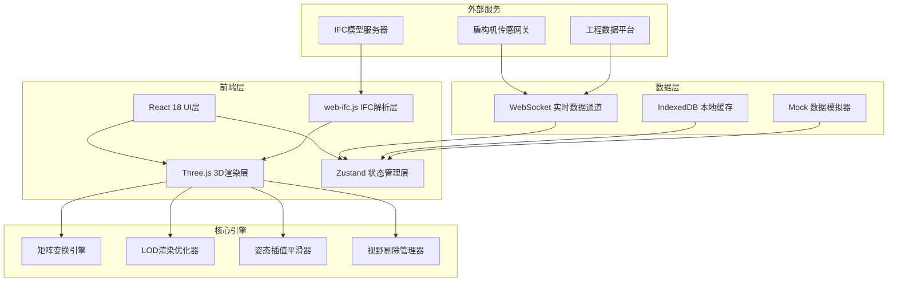
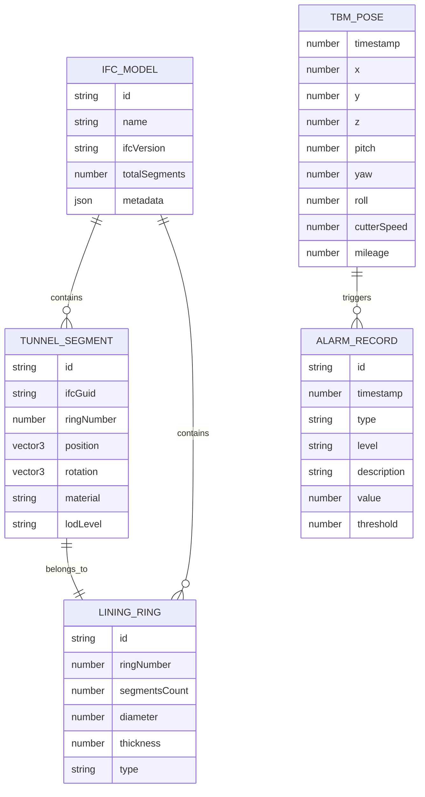

## 1. 架构设计



---

## 2. 技术描述

### 2.1 前端技术栈
- **框架**: React 18 + TypeScript 5
- **构建工具**: Vite 5
- **样式**: TailwindCSS 3 + CSS Modules
- **状态管理**: Zustand 4
- **路由**: React Router DOM 6
- **3D引擎**: Three.js r160
- **IFC解析**: web-ifc 0.0.51 + three-mesh-ifc
- **后处理**: @react-three/postprocessing
- **图表**: Recharts 2
- **图标**: Lucide React

### 2.2 核心技术选型理由
- **Three.js**: 工业级WebGL渲染引擎，支持复杂矩阵变换与高性能渲染
- **web-ifc.js**: 浏览器端原生IFC解析，无需后端转换，支持IFC2x3/IFC4标准
- **Zustand**: 轻量状态管理，适合高频实时数据更新场景
- **WebSocket**: 全双工通信，支持毫秒级传感数据推送

### 2.3 后端技术栈（模拟服务）
- **框架**: Express 4
- **WebSocket**: ws 8
- **CORS**: 支持跨域访问

---

## 3. 路由定义

| 路由 | 页面组件 | 功能说明 |
|------|----------|----------|
| `/` | `MonitorPage` | 三维监控主页面，核心大屏展示 |
| `/dashboard` | `DashboardPage` | 数据仪表板，多参数对比分析 |
| `/model` | `ModelPage` | 模型管理，IFC上传解析 |
| `/settings` | `SettingsPage` | 系统配置页面 |

---

## 4. API 定义

### 4.1 WebSocket 实时数据协议

```typescript
// 盾构机六自由度姿态数据
interface TbmPoseData {
  timestamp: number;
  position: {
    x: number;
    y: number;
    z: number;
  };
  rotation: {
    pitch: number;
    yaw: number;
    roll: number;
  };
  cutterHead: {
    speed: number;
    torque: number;
    rotation: number;
  };
  thrust: {
    totalForce: number;
    speed: number;
  };
  ringCount: number;
  mileage: number;
}

// WebSocket 消息格式
interface WsMessage<T> {
  type: 'pose' | 'alarm' | 'status';
  data: T;
}
```

### 4.2 REST API 定义

| 方法 | 路径 | 说明 | 请求参数 | 返回格式 |
|------|------|------|----------|----------|
| GET | `/api/models` | 获取模型列表 | - | `{ id, name, size, uploadTime }[]` |
| POST | `/api/models/upload` | 上传IFC模型 | `FormData` | `{ id, status }` |
| GET | `/api/models/:id` | 获取模型详情 | - | `{ id, name, segments, metadata }` |
| GET | `/api/history` | 获取历史数据 | `{ startTime, endTime }` | `TbmPoseData[]` |
| GET | `/api/settings` | 获取系统配置 | - | `SettingsConfig` |
| PUT | `/api/settings` | 更新系统配置 | `SettingsConfig` | `{ success: boolean }` |

---

## 5. 数据模型

### 5.1 实体关系图



### 5.2 核心类型定义

```typescript
// 变换矩阵层级
interface TransformHierarchy {
  root: THREE.Matrix4;
  body: THREE.Matrix4;
  cutterHead: THREE.Matrix4;
  screwConveyor: THREE.Matrix4;
  erector: THREE.Matrix4;
}

// LOD层级配置
interface LODConfig {
  level0: { distance: number; detail: 'high' };
  level1: { distance: number; detail: 'medium' };
  level2: { distance: number; detail: 'low' };
  level3: { distance: number; detail: 'billboard' };
}

// 视锥体剔除配置
interface FrustumCullingConfig {
  enabled: boolean;
  margin: number;
  dynamicLOD: boolean;
  occlusionCulling: boolean;
}
```

---

## 6. 目录结构

```
src/
├── components/
│   ├── three/
│   │   ├── Scene.tsx              # 3D场景主组件
│   │   ├── TBMModel.tsx           # 盾构机模型组件
│   │   ├── TunnelModel.tsx        # 隧道模型组件
│   │   ├── LODManager.ts          # LOD管理类
│   │   ├── MatrixEngine.ts        # 矩阵变换引擎
│   │   └── IfcLoader.ts           # IFC加载器
│   ├── ui/
│   │   ├── PosePanel.tsx          # 姿态参数面板
│   │   ├── ProgressPanel.tsx      # 进度面板
│   │   ├── StatusBar.tsx          # 顶部状态栏
│   │   ├── ControlBar.tsx         # 底部控制栏
│   │   └── AlarmIndicator.tsx     # 报警指示器
│   └── charts/
│       ├── GaugeMeter.tsx         # 仪表盘组件
│       └── DataCurve.tsx          # 数据曲线组件
├── hooks/
│   ├── useWebSocket.ts            # WebSocket连接Hook
│   ├── useTbmPose.ts              # 盾构机姿态Hook
│   ├── useAnimationFrame.ts       # 动画帧Hook
│   └── useLOD.ts                  # LOD控制Hook
├── store/
│   ├── poseStore.ts               # 姿态数据Store
│   ├── modelStore.ts              # 模型数据Store
│   └── settingsStore.ts           # 系统设置Store
├── utils/
│   ├── matrixUtils.ts             # 矩阵运算工具
│   ├── ifcUtils.ts                # IFC解析工具
│   ├── interpolation.ts           # 插值算法
│   └── geometry.ts                # 几何计算工具
├── types/
│   ├── tbm.ts                     # 盾构机类型定义
│   ├── ifc.ts                     # IFC类型定义
│   └── websocket.ts               # WebSocket类型定义
├── pages/
│   ├── MonitorPage.tsx            # 监控主页面
│   ├── DashboardPage.tsx          # 数据仪表板
│   ├── ModelPage.tsx              # 模型管理页
│   └── SettingsPage.tsx           # 系统配置页
└── mock/
    ├── poseSimulator.ts           # 姿态数据模拟器
    └── ifcData.ts                 # 模拟IFC数据
```

---

## 7. 核心技术实现要点

### 7.1 矩阵层级变换系统
- 采用四元数表示旋转，避免欧拉角万向节锁
- 盾构机分为5层变换节点：Root → Body → CutterHead/Screw/Erector
- 刀盘旋转与机身姿态解耦计算，最后矩阵相乘

### 7.2 IFC模型处理流程
1. Web Worker 后台解析IFC文件，避免主线程阻塞
2. 提取 IfcBuildingElementProxy 类型的衬砌管片
3. 按环号分组建立拓扑关系
4. 生成3个LOD层级的几何体

### 7.3 LOD与视野剔除策略
- 基于距离的LOD切换：近(0-50m)、中(50-200m)、远(200-500m)、极远(>500m)
- 视锥体剔除：仅渲染相机视野内的管片
- 遮挡剔除：利用深度预通道实现隧道内壁遮挡

### 7.4 姿态数据平滑处理
- 采用指数移动平均(EMA)滤波
- 前瞻插值算法避免抖动
- 异常数据检测与剔除

---
